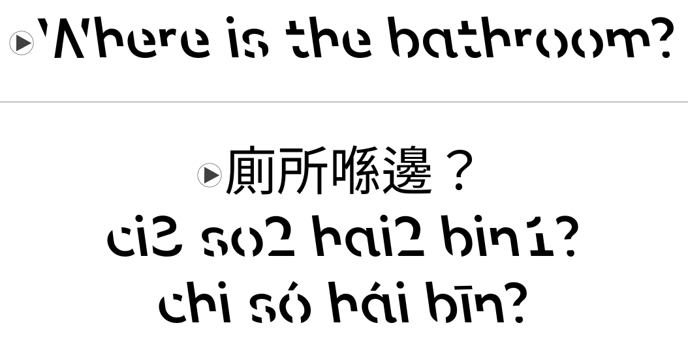

# Basic Cantonese Phrases Anki Deck Package

An Anki flashcard deck containing 32 basic Cantonese and English phrases with audio from [Cantonese Class 101: Key Cantonese Phrases/](https://www.cantoneseclass101.com/key-cantonese-phrases/). Features traditional Chinese characters, as well as Jyutping and Yale romanizations.

# For Users

1. [Download and install Anki](https://apps.ankiweb.net/#download), an offline flashcard app featuring spaced repetition, onto your device (free for Windows/Mac/Linux/Android, paid on iOS).

2. Download the latest version of the .apkg deck from the [Releases page](https://github.com/akcantonese/anki-cantonese-flashcards/releases).

3. Open Anki and on the starting page, click "Import File", then select the .apkg file that you downloaded.

# For Developers

You must have a working Git client and Python3 installation to run the deck generator program.

First, clone the repository and install its dependencies:

    git clone https://github.com/akcantonese/anki-cantonese-flashcards
    pip install -r requirements.txt

To add new cards, modify `basic-english-cantonese-phrases.csv` and then run the python script:

    python3 anki-cantonese-audio-csv-importer.py

# Advanced Usage

Download the [Sans Forgetica Extended](https://github.com/akovacs/sans-forgetica-extended) font and install it into your operating system. This font uses principles of cognitive psychology to help make your study notes more memorable.
